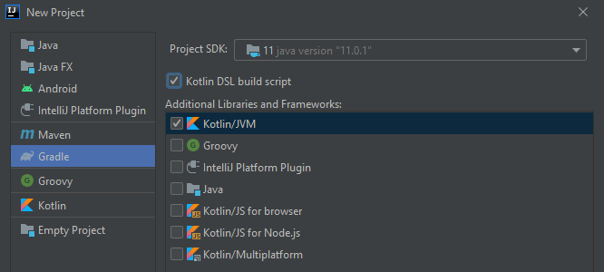

This article is part of the **Twitter bot with Kotlin in AWS series** showing how [I created a Twitter bot for Vue 3 updates](/dev-blog/twitter-bot-vue-3-updates.html). But this article works as an independent article on how to create a Lambda function in Kotlin.

You could manage your AWS Lambda functions in the browser AWS console. But I'm going to use the AWS CLI as I believe that leads to less manual work.

## AWS setup

* You need to create an account and sign in to the [AWS Management Console](http://console.aws.amazon.com/)
* [Create an Administrator IAM User](https://docs.aws.amazon.com/IAM/latest/UserGuide/getting-started_create-admin-group.html). Remember to copy the AWS Access Key ID and AWS Secret Access Key for later use.
* [Create a role](https://docs.aws.amazon.com/IAM/latest/UserGuide/id_roles_create_for-service.html) and select AWS service and Lambda. Give permission to the resources the Lambda function is going to need. I have given permission to CloudWatch Logs, DynamoDB, and Secrets Manager.

## Setting up the AWS CLI

Install the [AWS CLI](https://docs.aws.amazon.com/cli/latest/userguide/install-cliv2.html) to your computer and verify it is installed by running `aws --version` in your terminal. 

Now you need to configure the CLI by using the IAM user created previously. 
Run `aws configure` in your terminal and enter the AWS Access Key ID and AWS Secret Access Key, region name (available codes can be found [here](https://docs.aws.amazon.com/AWSEC2/latest/UserGuide/using-regions-availability-zones.html#concepts-available-regions)) and output (json, yaml, text or table) where I use json.

## Kotlin Project

I'm using [IntelliJ](https://www.jetbrains.com/idea/) as my editor. Now go ahead and create a new project and select gradle, Kotlin DSL build script (not required), and Kotlin/JVM.



Create file `Main.kt` that will hold our function we want to deploy to an AWS Lambda function.

```kotlin
class Main {
    fun runLambda() = "Hello World"
}
```

We need to make sure that our .jar file which we are going to upload will be a fat jar, containing all our dependencies, by altering the `build.gradle.kts` file and adding this to tasks. We can also change the filename if we want.
```kts
jar {
    archiveFileName.set("twitter-bot-vue-3.jar")
    from(configurations
        .runtimeClasspath.get().files.filter { it.exists() }
        .map { if (it.isDirectory) it else zipTree(it) })
}
```

## Deploy to AWS
Build .jar:

```bash
gradlew build
```

[Create Lambda function](https://awscli.amazonaws.com/v2/documentation/api/latest/reference/lambda/create-function.html) (For the role parameter, you can copy the Role ARN from the setup):

```bash
aws lambda create-function --function-name twitter-bot-vue-3 --zip-file fileb://build/libs/twitter-bot-vue-3.jar --runtime java11 --role arn:aws:iam::<account_id>:role/<role>  --handler Main::runLambda --timeout 15 --memory-size 512
```

[Update Lambda function](https://awscli.amazonaws.com/v2/documentation/api/latest/reference/lambda/update-function-code.html):

```bash
aws lambda update-function-code --function-name twitter-bot-vue-3 --zip-file fileb://build/libs/twitter-bot-vue-3.jar
```

[Invoke Lambda function](https://awscli.amazonaws.com/v2/documentation/api/latest/reference/lambda/invoke.html):

```bash
aws lambda invoke --function-name twitter-bot-vue-3 output.txt
```

Now go ahead to check the output.txt file to see if our function ran correctly.