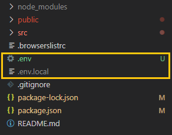

Sometimes you want your app to behave differently in local development and production. Maybe they should point to a different backend or use different API keys. Vue has very good documentation about it, [Modes and Environment Variables](https://cli.vuejs.org/guide/mode-and-env.html#environment-variables). But I will try to keep it shorter, for the use I often need.

You can create differently `.env` files at the root of your project.



Alternatives:

```
.env                    # loaded in all cases
.env.local              # loaded in all cases, ignored by git
.env.development        # for vue-cli-service serve
.env.development.local  # for vue-cli-service serve, ignored by git
.env.test               # for vue-cli-service test:unit
.env.test.local         # for vue-cli-service test:unit, ignored by git
.env.staging            # custom mode, for --mode staging
.env.staging.local      # custom mode, for --mode staging, ignored by git
.env.production         # for vue-cli-service build and vue-cli-service test:e2e
.env.production.local   # for vue-cli-service build and vue-cli-service test:e2e, ignored by git
```

env files with .local are ignored by git, so you can keep keys you don't want to be exposed there.

The format of the environment variables is `key=value`. For variables to be statically embedded into the client bundle, meaning it is available in your JavaScript code, it needs to start with `VUE_APP_` (`NODE_ENV` and `BASE_URL` are also available).

Examples of use cases:
_.env_:

```
VUE_APP_API_URL=https://mycoolapi.com
VUE_APP_API_KEY=[PUBLIC_KEY]
```

_.env.development_:

```
VUE_APP_API_URL=http://localhost:8080
```

_.env.development.local_:

```
VUE_APP_API_KEY=[PRIVATE_KEY]
```

Then you can get the variables from the JavaScript code like this:

```js
const url = process.env.VUE_APP_API_URL;
```

That's it :) 

Remember to avoid exposing private secrets in the bundle. Even though if you have it in .env.local, it will be "somewhere" in the bundle after npm run build, though it is hard to find.