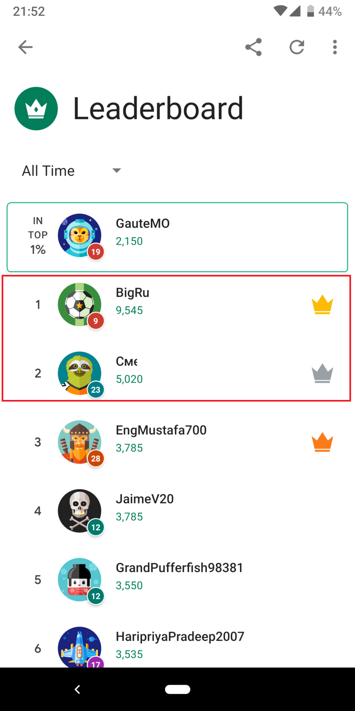
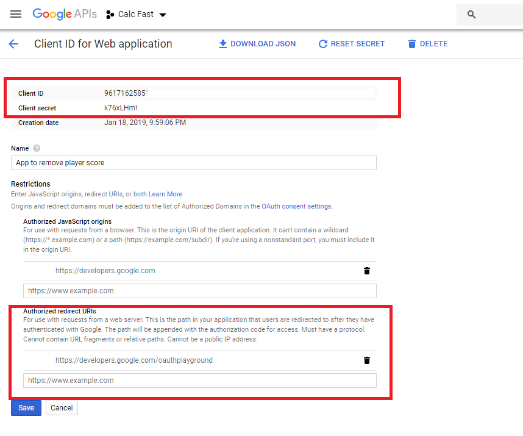
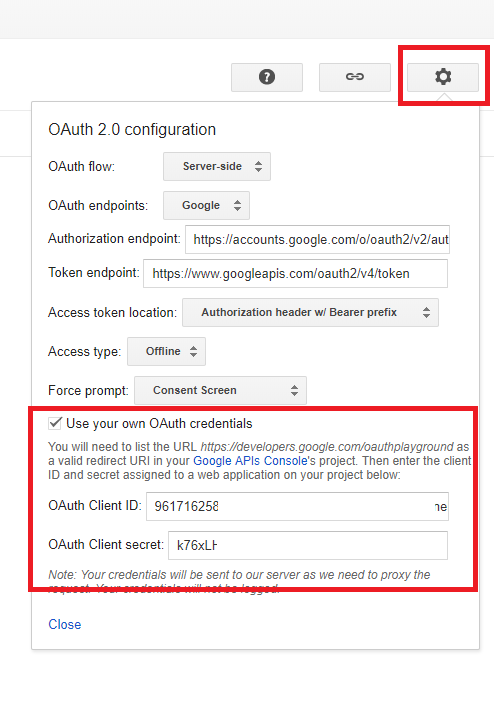
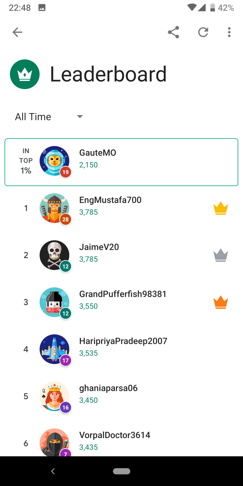

I recommend using the Google Play Games Services leaderboard in your Android game. It's fast to get up, it gives you the UI and stores the scores for you. You should set a limit score to avoid cheaters, but you can't set it too low. Because you don't know how good your players will be before you launch. After a while, you see some players have an unnatural score you want to delete. Let me show you how.

<figure class="medium-img">
    
    <figcaption>Players we want to remove</figcaption>
</figure>

## Google Play Console

1. Go to your [Google play console](https://play.google.com/apps/publish/).
2. Go to **Game services** in the left menu.
3. Open your game.
4. Copy the **applicationId** for later.
   <ImgWithZoom src="./assets/gpgs-hide-player/appid.png" alt="Console"/>
5. Click **Leaderboard** in the left menu. Then copy the **leaderboardId** for later.
   <ImgWithZoom src="./assets/gpgs-hide-player/leaderboardid.png" alt="Console"/>
6. Go to **Linked apps** in the left menu.
7. Click **Link another app** and choose **web**.
8. Give it a rememberable name such as «App to remove player score».
9. Launch URL doesn’t matter, you can enter: `https://developers.google.com/oauthplayground/`
10. Save and continue.
11. Authorize your app.
12. Confirm.
13. Open the APIs console by clicking the **here in the APIs Console** link.

## APIs Console

1. Go to the tab you opened in the previous step or use this link.
2. Click on the web application name you created in Google Play Console step 8.
3. Copy the **Client ID** and **Client Secret** for later. If you don’t see it you can find it in the **DOWNLOAD JSON** file.
4. Remove the link in the Authorized redirect URIs and add `https://developers.google.com/oauthplayground`. _N.B. don't end the URL with a slash_. Then save.

## OAuth 2.0 Playground

1. Open the [Google Developers OAuth 2.0 Playground](https://developers.google.com/oauthplayground/).
2. Click the settings wheel.
3. Check **Use your own OAuth credentials** checkbox.
4. Enter the **Client ID** and **Client Secret** from APIs Console step 3.
   
5. On the left side, expand Google Play Game Services Management API v1management and click **https://www.googleapis.com/auth/games**
6. Click **Authorize APIs**.
7. Sign in with your account.
8. Click **Exchange authorization code for tokens**.
9. Enter the [GET request](https://developers.google.com/games/services/web/api/scores/list) **https://www.googleapis.com/games/v1/leaderboards/<mark>leaderboardId</mark>/scores/PUBLIC?maxResults=10&timeSpan=all_time** and change the leaderboardId with the id you got from Google Play Console step 5.
10. Click **Send the request**.
11. Search for the playerId in the response. You will find it under items. Copy the playerId for the players you want to hide from the leaderboard.
12. Change HTTP Method to **POST**.
13. Enter the [POST request](https://developers.google.com/games/services/management/api/players/hide) **https://www.googleapis.com/games/v1management/applications/<mark>applicationId</mark>/players/hidden/<mark>playerId</mark>** and change the playerId from step 11 and applicationId from Google Play Console step 4.
14. Click **Send the request**.

## Summary

<figure class="medium-img">
    
    <figcaption>Leaderboard as it should be. The unnatural scores are gone.</figcaption>
</figure>

There you go, the player will be gone from your leaderboard! If you want, you can clean up by deleting your web app from the Google Play Console and the APIs Console. If you regret your hiding, you can [unhide them](https://developers.google.com/games/services/management/api/players/unhide).
