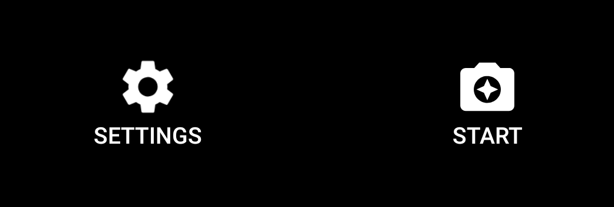

You can easily create a button with both a drawable and text with the view Button. No need to create an ImageButton and a TextView, align them together and add a click listener twice.

```xml
<Button
android:text="Start"
android:drawableTop="@drawable/start_wrap"
android:drawableTint="@android:color/white"
android:drawablePadding="10dp"
android:background="@android:color/transparent"
android:textColor="@android:color/white"/>
```

<figure>



<figcaption>The wanted outcome</figcaption>
</figure>

You can also place the image under, to the left or right.

The reason I have wrapped my drawable in another drawable is to control the size just for this button. Like this:

```xml
<?xml version="1.0" encoding="utf-8"?>
<layer-list xmlns:android="http://schemas.android.com/apk/res/android" >
  <item
  android:drawable="@drawable/baseline_camera_enhance_24"
  android:width="40dp"
  android:height="40dp"
  />
</layer-list >
```

<style scoped>
figcaption{
  text-align: center;
}
</style>
